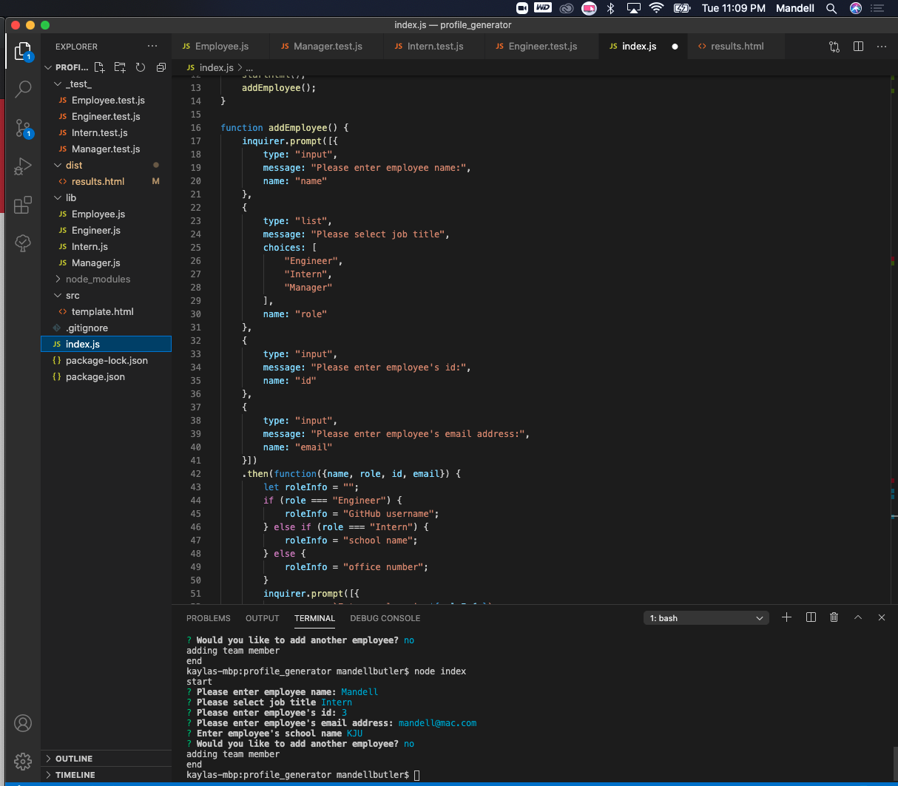
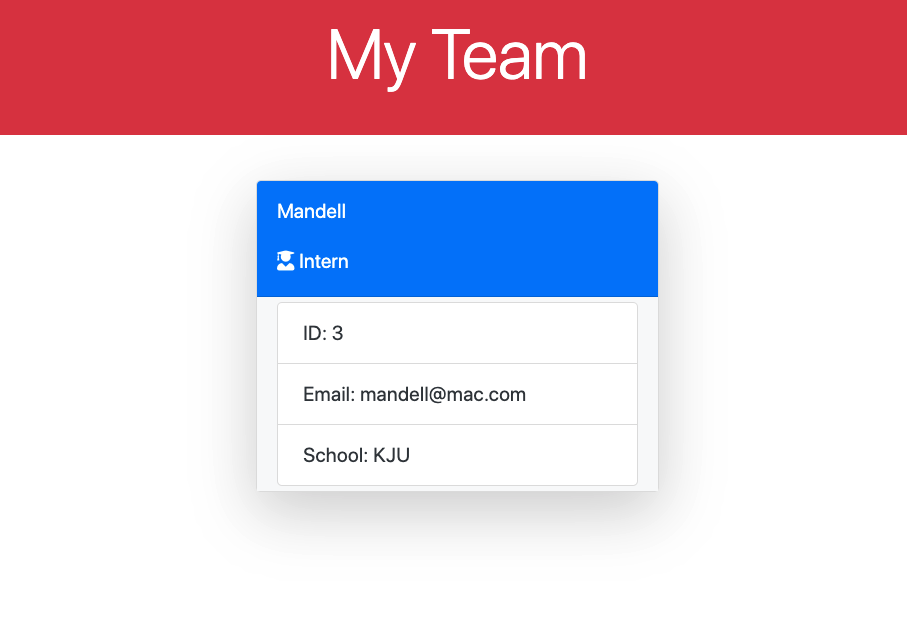
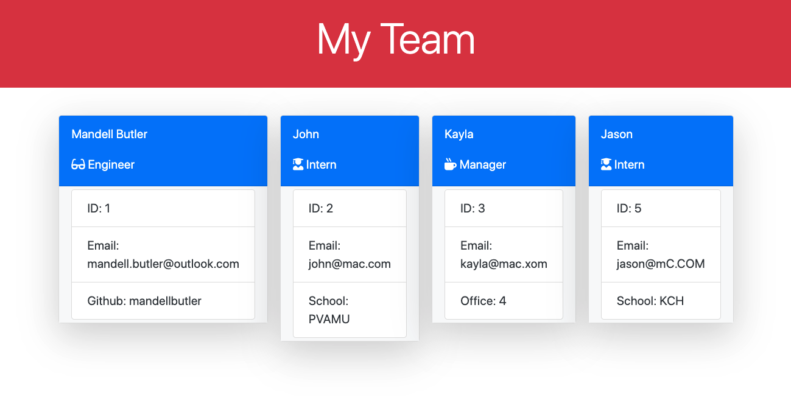

# Profile Generator

# Description
This team profile generator was designed to help business leaders keep a well organized and detailed list of their employees.
By completing a few quick prompts, a HTML page is immediately rendered with employees listed on individual name cards. Each card list provides the employees name, id, email and role within the company. Additional information is provided, based on the role performed.

# Installation
To install, simply clone the Github repository and add it to your local repo via your choice code-editing software (ie Visual Studio Code).

# Usage
Once the application has been cloned to your local repository, and launched, open the intergrated terminal in the, index.js file. Enter the command 'node index' and you will be greeted with a series of prompts. Once the prompts have been completed for each employee, a fully rendered HTML page will appear in the "results.html" file, located in the "dist" folder.

Please follow the link to view the Tutorial Video:
https://drive.google.com/file/d/1BpYKY8Og927c9gsIzBHoKeI-2KUS-LnN/view

Please see below for screenshots of the prompts and generated HTML files!

* User is greeted with a series of prompts:

* Name cards generate with provided user information:
 

* As the list of employees grows, more name cards are generated:

# Technology
This application was made possible with the use of the follow dev tools:
* Javascript
* Es6
* Node.js
* Inquirer
* Jest

# Questions

Please feel free to contact me, should you have any questions!

Github: https://github.com/mandellbutler

Email: mandell.butler@outlook.com
